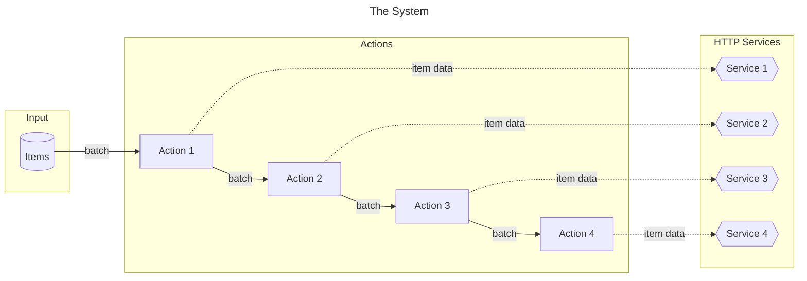

# Processing Actions Playground 

_Processing Actions_ is a playground for practicing software design skills, both alone and with peers. 

What are the issues with the current design? How can the design be improved to cater for changes and extensions to the system? 

Ideas for redesign can be tried out and evaluated by refactoring the provided codebase to new structures. 

## The System
The repository offers a Java implementation of the central part of an imaginary system for putting a collection of data carrying items through a number of processing steps called _actions_. The total number of items is subdivided into smaller chunks called _batches_. 

Actions are stringed together to process batches of items in a particular order, much like an assembly line. Each action is able to process a batch of items at a time. For each action, the processing involves passing relevant item data to an external HTTP service.



Both the actions and the imaginary HTTP services offer some variation.

Actions can implement conditional rules for selecting which items to process. The current variation includes:
* Always passing all items to the HTTP service (no conditions)
* Passing only items that have not previously failed for any preceding action
* Passing only items for which there is data of interest

The HTTP services differ in how they are able to receive and handle items. The current variation includes:
* Accepting a single item per request
* Accepting a collection of items per request that will succeed or fail as a whole
* Accepting a collection of items per request that can succeed or fail individually


## Evolution

There is number of ways in which the system can be required to change, including:
* Actions
  * Addition of new actions for additional processing steps towards new services
  * Changes in conditions for whether items are applicable for processing in an action
* Items
  * Changes in how processing results are logged for later reporting, e.g. whether an item has been skipped due to issues in prior actions or due to not having relevant data for this action
  * Addition of data per item
  * Changes in how item data is represented 
* HTTP services
  * Change from accepting single item per request to a collection of items
  * Change from handling a collection of items together to individual processing
  * Change in request format and contents
  * Change in response format and contents

## Questions to discuss
- Thoughts on the current design and code?
  - What is unclear?
  - What du you like about the current design?
  - What code smells do you react to?
  - Which parts are you itching to change?
- What is the consequence of implementing each type of change listed above?
  - Code duplication?
  - Test duplication?
  - Complexity?
- How would you restructure the code to allow changes to be made easier and safer?


## Making private clone of repo
In order to attempt a redesign you want to create a private clone of the repo. This is documented [here](https://docs.github.com/en/repositories/creating-and-managing-repositories/duplicating-a-repository).

1. Create a bare clone of the repo. (This is temporary and will be removed so just do it wherever.)
```bash
git clone --bare git@github.com:nchaugen/ProcessingActionsWorkshop.git
```
2. Create a new private repo on Github and give it a suiting name, eg. ProcessingActionsRedesign.

3. Mirror-push your bare clone to your new private repo.
> Replace <your_username> with your actual Github username, and <your_repo_name> with your private repository name in the url below.
```bash
cd ProcessingActionsWorkshop.git
git push --mirror git@github.com:<your_username>/<your_repo_name>.git
```

4. Remove the temporary local repo you created in step 1.
```bash
cd ..
rm -rf ProcessingActionsWorkshop.git
```

5. You can now clone your ProcessingActionsRedesign repo on your machine (in my case in the code folder).
```bash
cd ~/code
git clone git@github.com:<your_username>/<your_repo_name>.git
```

6. If you want, add the original repo as remote to fetch (potential) future changes. Make sure you also disable push on the remote (as you are not allowed to push to it anyway).
```bash
git remote add upstream git@github.com:nchaugen/ProcessingActionsWorkshop.git
git remote set-url --push upstream DISABLE
```

7. You can list all your remotes with `git remote -v`. You should see:
```bash
origin	git@github.com:<your_username>/<your_repo_name>.git (fetch)
origin	git@github.com:<your_username>/<your_repo_name>.git (push)
upstream	git@github.com:nchaugen/ProcessingActionsWorkshop.git (fetch)
upstream	DISABLE (push)
```
When you push, do so on origin with `git push origin`.

When you want to pull changes from upstream you can just fetch the remote and rebase on top of your work.
```bash
git fetch upstream
git rebase upstream/master
```
And solve the conflicts if any
